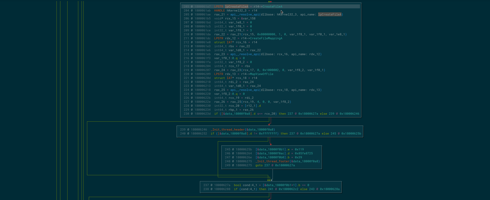
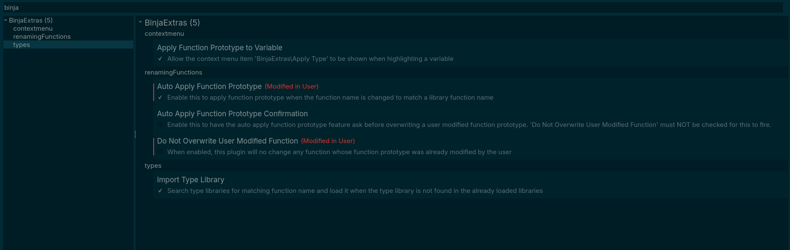

# binjaextras (v0.0.4)

Author: **xorhex**

Copyright: **2025**

_Various features to make windows malware analysis easier._

## Description:

Various features to make windows malware analysis easier like adding function prototypes.

### Features:

#### Apply Type

1. Rename the variable to the API name
2. Right click on the variable and select `BinjaExtras` and click `Apply Type`

#### Apply Type to Function

Sometimes a custom function will resolve an API and then jump to it.  The function prototype of the function that contains this code that both resolves and calls/jumps to the API function matches the corrisponding API function prototype being resolved - simply rename the function and the type is auto applied.

### Settings

All of the features can be controlled (enabled/disabled) via the settings.

## Installation Instructions

### Darwin

Nothing special, just install through the Binary Ninja plugin manager.

### Windows

Nothing special, just install through the Binary Ninja plugin manager.

### Linux

Nothing special, just install through the Binary Ninja plugin manager.

## Change Log

### Version v0.0.4

- move the Usage content into the readme so that it will render in BinaryNinja's plugin manager

## Minimum Version

This plugin requires the following minimum version of Binary Ninja:

* 6455

## License

This plugin is released under a MIT license.
## Metadata Version

2
